# S1 | Prog: Workshop

## ⭐ Ne garder que le vert

## ⭐ Échanger les canaux

## ⭐ Noir & Blanc

## ⭐ Négatif

## ⭐ Dégradé

## ⭐⭐ Miroir

## ⭐⭐ Image bruitée
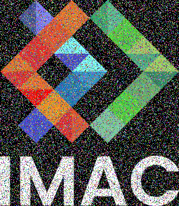

## ⭐⭐ Rotation de 90°

## ⭐⭐ RGB split
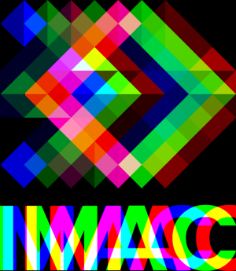

## ⭐⭐ Luminosité

## ⭐⭐(⭐) Disque

### ⭐ Cercle
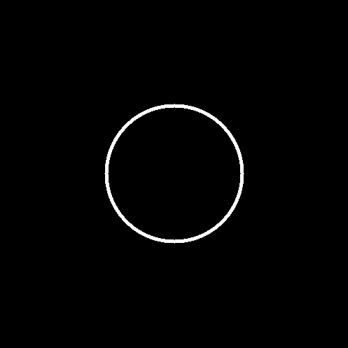

### ⭐⭐⭐ Rosace
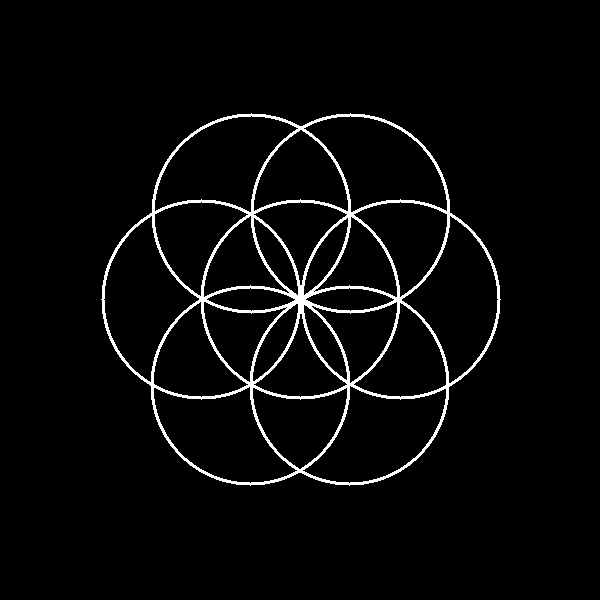

## ⭐⭐ Mosaïque

### ⭐⭐⭐⭐ Mosaïque miroir

## ⭐⭐⭐ Glitch

## ⭐⭐⭐ Tri de pixels
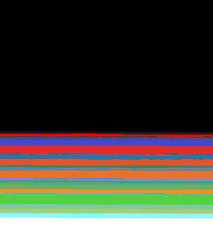

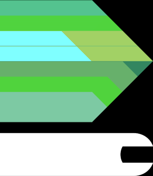

## ⭐⭐⭐ Dégradés dans l'espace de couleur Lab

## ⭐⭐⭐(⭐) Fractale de Mandelbrot
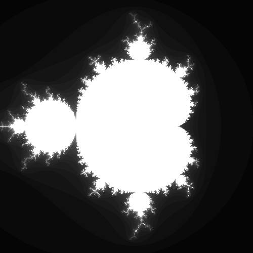

## ⭐⭐⭐(⭐) Tramage

## ⭐⭐⭐(⭐) Normalisation de l'histogramme

## ⭐⭐⭐⭐ Vortex

## ⭐⭐⭐⭐ Convolutions

### ⭐ Netteté, Contours, etc.

## Tests perso
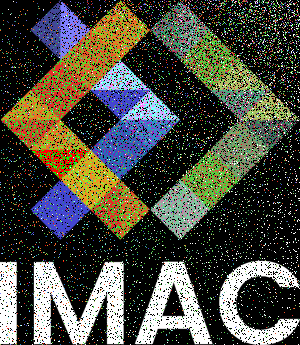

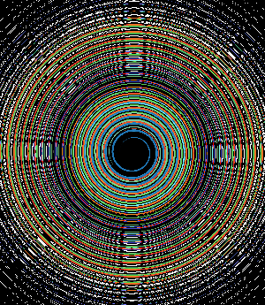
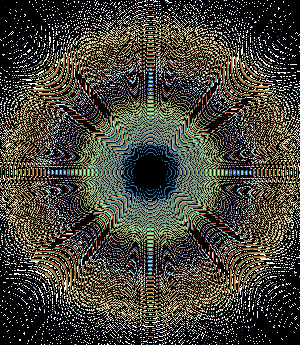
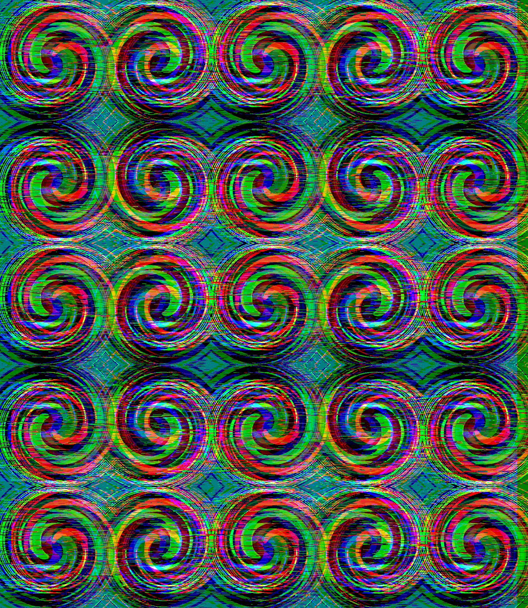