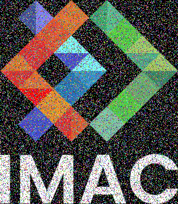
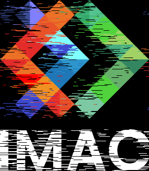
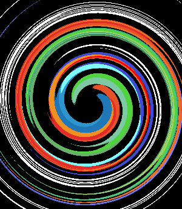

# S1 | Prog: Workshop

## ⭐ Ne garder que le vert
Le but de cet exercice est de mettre pour chaque pixels les valeurs du rouge et du bleu à 0.

## ⭐ Échanger les canaux
L'objectif ici est que pour chaque pixels on inverse les valeurs du rouge et du bleu.

## ⭐ Noir & Blanc
L'objectif pour cet exercice est de mettre l'image en noir et blanc. Pour ce faire il faut pour chaque pixels calculer la valuer de la luminance et l'attribuer aux différents cannaux rouge, vert et bleu.

## ⭐ Négatif
Le but ici est d'inverser les couleurs de l'image, il faut donc pour chaque pixels attribuer une nouvelle valeur correspondant à l'opération 1 - la couleur d'origine du pixel.

## ⭐ Dégradé
Pour cet exercie, il faut calculer le niveau de gris en fonction de la position en x du pixel.

## ⭐⭐ Miroir
Le but de cet exercice est d'inverser le sens de l'image sur l'axe vertical. Il suffit donc d'inverser les valeurs des pixels sur la moitié de l'image. 

## ⭐⭐ Image bruitée
Ici, il faut utiliser une fonction pour remplacer des pixels aléatoirement dans l'image par une couleur aléatoire également.

## ⭐⭐ Rotation de 90°
Pour tourner l'image, il faut créer une nouvelle image et attribuer pour chaque pixel les valeurs des pixels de l'ancienne tout en réalisant un petit calcul pour qu'ils soient placer correctement.

## ⭐⭐ RGB split
Pour cet exercice, il faut créer une nouvelle image et attribuer à l'image les valeurs des pixels rouge et bleu en décaler par rapport à l'image d'origine.

## ⭐⭐ Luminosité
Pour jouer avec la luminosité d'une image il suffit de remplacer les valeurs des pixels par ces mêmes valeurs à une puissance. 
Ici, pour éclaircir l'image, j'ai utiliser la puissance 0.5 (égale à la racine carré).
 
Pour assombrir cette image j'ai utilisé la puissance de 2.

## ⭐⭐(⭐) Disque
Dessine un disque plein de rayon donné centré au milieu de l'image. Chaque pixel à l'intérieur du rayon est coloré en blanc.

### ⭐ Cercle
Dessine un cercle avec un rayon donné et une épaisseur définie. Les pixels situés dans la zone de l'anneau (entre rayon et rayon - épaisseur) sont colorés en blanc.

### ⭐⭐⭐ Rosace
Dessine une rosace composée d'un cercle central entouré de plusieurs cercles, disposés régulièrement autour du centre.Chaque cercle est dessiné de manière similaire à la fonction circle

## ⭐⭐ Mosaïque
Crée une mosaïque répétée de l'image d'origine. Étend l'image d'origine dans une plus grande taille en répétant ses pixels.

### ⭐⭐⭐⭐ Mosaïque miroir
Les blocs répétés sont retournés horizontalement ou verticalement selon leur position, créant un effet de réflexion.

## ⭐⭐⭐ Glitch
Sélectionne des rectangles aléatoires dans l'image et échange leurs pixels.

## ⭐⭐⭐ Tri de pixels
Trie les pixels de l'image selon leur luminosité.
Trie tous les pixels globalement (de l'image entière).
 
Trie les pixels colonne par colonne.
 
Trie les pixels ligne par ligne.
 
Trie des blocs aléatoires de 70 pixels.

## ⭐⭐⭐ Dégradés dans l'espace de couleur Lab
Crée un dégradé de couleurs entre deux couleurs définies. Utilise l'espace de couleur OKLab pour des transitions naturelles.

## ⭐⭐⭐(⭐) Fractale de Mandelbrot
Crée une fractale avec la formule z = z * z + c.

## ⭐⭐⭐(⭐) Tramage
 
Utilise une matrice de Bayer pour convertir l'image en noir et blanc, tout en simulant des niveaux de gris par densité de pixels.

## ⭐⭐⭐(⭐) Normalisation de l'histogramme
Ajuste la luminosité de l'image pour utiliser toute la plage de valeurs entre le pixel le plus sombre et le plus lumineux.

## ⭐⭐⭐⭐ Vortex
Fait pivoter chaque pixel autour du centre de l'image, avec un angle proportionnel à la distance.

## ⭐⭐⭐⭐ Convolutions
Applique une convolution avec un noyau gaussien pour flouter l'image.

### ⭐ Netteté, Contours, etc.
Utilise des matrices de convolution spécifique pour calculer les différents effets.

## Tests perso
Mélange d'échange de canaux de couleurs et de bruit sur l'image.
 
Mélange d'échange de canaux de couleurs et de garder une seule couleur.
 
Lune réaliser lors de l'exercie cerle.
 
Vortex avec différente valeurs très élevées de la rotation.

 
Mélange de nombreux effets du workshop:
- Vortex ;
- Mosaïque miroir ;
- Tri de pixels ;
- RGB split.
